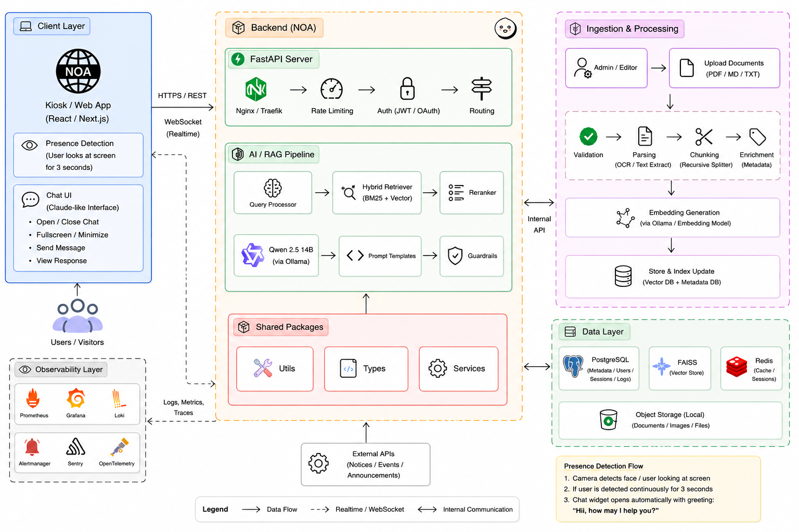

# IEM-UEM Kiosk Chatbot

A campus-gate kiosk system for IEM UEM (Institute of Engineering &
Management, University of Engineering and Management, Kolkata): scrolling
accreditation/achievement tickers, today's event banner, and a chat widget
that answers questions grounded strictly in official governing body / academic
council documents -- with voice input/output, camera-based presence
detection, and an admin portal for managing what's shown on screen.



## Repo layout

```
iem-uem-chatbot/
├── backend/          RAG pipeline + FastAPI server (Python)
│   ├── app/
│   │   ├── config.py         all tunables (model, retrieval, API, DB, rate limits)
│   │   ├── ingest.py          document loading/chunking/indexing
│   │   ├── rag.py             hybrid retriever + LangGraph pipeline
│   │   ├── api.py             FastAPI app: /ask, /content, admin endpoints, /metrics
│   │   ├── auth.py            admin login (DB-backed, bcrypt) + JWT
│   │   ├── db.py               Postgres engine/session setup
│   │   ├── models.py           SQLAlchemy models (AdminUser)
│   │   └── content_store.py   JSON-backed tickers + event banner storage
│   ├── knowledge_base/  source .md/.pdf/.txt files
│   ├── run_ingest.py     build/update the index
│   ├── run_chat.py        terminal Q&A for testing
│   ├── run_calibrate.py   tune the off-topic relevance threshold
│   ├── run_api.py          run the FastAPI server
│   └── manage_admin.py      create/list/delete admin accounts
│
├── frontend/         Kiosk UI + Admin Portal (TypeScript + React + Vite)
│   └── src/
│       ├── api.ts             backend API client
│       ├── components/         KioskHeader, Ticker, EventBanner, ChatWidget
│       ├── hooks/               presence detection, TTS, STT
│       ├── admin/                admin portal (login, event/ticker editors)
│       └── data/                 fallback mock content
│
├── deploy/           Production deployment: systemd, nginx, monitoring
│   ├── systemd/        keeps the backend running (auto-restart, survives reboots)
│   ├── nginx/            SPA fallback + reverse proxy + HTTPS template
│   └── monitoring/        Prometheus + Grafana + Loki (Docker Compose)
│
└── docs/
    └── architecture.md  how the pieces fit together
```

## Status

| Piece | Status |
|---|---|
| RAG backend (retrieval, grounding, off-topic refusal) | Working, testable via `backend/run_chat.py` |
| FastAPI server (`/ask`, content management, admin auth) | Working |
| Kiosk frontend (tickers, event banner, chat widget, fullscreen) | Working, connected to the real backend |
| Voice input/output (speech-to-text, text-to-speech) | Working (browser Web Speech API) |
| Presence detection (auto-open on approach, auto-collapse on leaving) | Working (face-api.js, client-side only) |
| Admin portal (event banner, tickers, index refresh) | Working, at `/admin` |
| Responsive layout (portrait kiosk display + landscape testing) | Working |
| Admin accounts (Postgres, bcrypt-hashed passwords) | Working, see `backend/README.md` |
| Rate limiting (`/ask`, `/auth/login`) | Working, tested |
| Prometheus metrics (`/metrics`) | Working, tested |
| systemd service, nginx SPA fallback, Grafana/Loki monitoring stack | Ready to deploy, see `deploy/README.md` |

See `docs/architecture.md` for how the pieces connect, and `deploy/README.md`
for taking this from "works on my machine" to a persistent, monitored
deployment.

## Quick start

**Backend:**
```bash
cd backend
pip install -r requirements.txt
python run_ingest.py
python manage_admin.py create --username admin   # first-time only
python run_api.py
```

**Frontend:**
```bash
cd frontend
npm install
npm run dev
```

Kiosk display: `http://localhost:5173`
Admin portal: `http://localhost:5173/admin` (an unobtrusive gear icon next to
the UEM logo on the homepage also links here).

**For a real deployment** (not just local testing), see `deploy/README.md`
for systemd, nginx, and monitoring setup.
